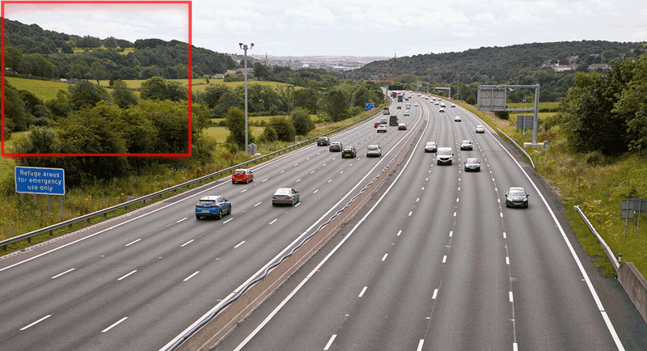

<div align="center">
<h1>
  SAHI: Slicing Aided Hyper Inference
</h1>

<h4>
  A lightweight vision library for performing large scale object detection & instance segmentation
</h4>

<h4>
    
</h4>

<div>
    <a href="https://colab.research.google.com/github/obss/sahi/blob/main/demo/inference_for_yolov5.ipynb"></a>
    <a href="https://huggingface.co/spaces/fcakyon/sahi-yolov5"></a>
    <a href="https://pepy.tech/project/sahi"></a>
    <a href="https://pepy.tech/project/sahi"></a>
    <br>
    <a href="https://badge.fury.io/py/sahi"></a>
    <a href="https://anaconda.org/conda-forge/sahi"></a>
    <a href="https://github.com/obss/sahi/actions?query=event%3Apush+branch%3Amain+is%3Acompleted+workflow%3ACI"></a>
    <br>
    <a href="https://doi.org/10.5281/zenodo.5718950"></a>
</div>
</div>

## <div align="center">Overview</div>

Object detection and instance segmentation are by far the most important fields of applications in Computer Vision. However, detection of small objects and inference on large images are still major issues in practical usage. Here comes the SAHI to help developers overcome these real-world problems with many vision utilities.

| Command  | Description  |
|---|---|
| [predict](https://github.com/obss/sahi/blob/main/docs/CLI.md#predict-command-usage)  | perform sliced/standard prediction using any [yolov5](https://github.com/ultralytics/yolov5)/[mmdet](https://github.com/open-mmlab/mmdetection) model |
| [predict-fiftyone](https://github.com/obss/sahi/blob/main/docs/CLI.md#predict-fiftyone-command-usage)  | perform sliced/standard prediction using any [yolov5](https://github.com/ultralytics/yolov5)/[mmdet](https://github.com/open-mmlab/mmdetection) model and explore results in [fiftyone app](https://github.com/voxel51/fiftyone) |
| [coco slice](https://github.com/obss/sahi/blob/main/docs/CLI.md#coco-slice-command-usage)  | automatically slice COCO annotation and image files |
| [coco fiftyone](https://github.com/obss/sahi/blob/main/docs/CLI.md#coco-fiftyone-command-usage)  | explore multiple prediction results on your COCO dataset with [fiftyone ui](https://github.com/voxel51/fiftyone) ordered by number of misdetections |
| [coco evaluate](https://github.com/obss/sahi/blob/main/docs/CLI.md#coco-evaluate-command-usage)  | evaluate classwise COCO AP and AR for given predictions and ground truth |
| [coco analyse](https://github.com/obss/sahi/blob/main/docs/CLI.md#coco-analyse-command-usage)  | calcualate and export many detection and segmentation error margin plots |
| [coco yolov5](https://github.com/obss/sahi/blob/main/docs/CLI.md#coco-yolov5-command-usage)  | automatically convert any COCO dataset to [yolov5](https://github.com/ultralytics/yolov5) format |

## <div align="center">Getting Started</div>

<details open>
<summary>
<big><b>Blogpost</b></big>
</summary>

Check the [official SAHI blog post](https://medium.com/codable/sahi-a-vision-library-for-performing-sliced-inference-on-large-images-small-objects-c8b086af3b80).

</details>

<details open>
<summary>
<big><b>Installation</b></big>
</summary>

- Install `sahi` using pip:

```console
pip install sahi
```

- On Windows, `Shapely` needs to be installed via Conda:

```console
conda install -c conda-forge shapely
```

- Install your desired version of pytorch and torchvision:

```console
pip install torch torchvision
```

- Install your desired detection framework (such as mmdet or yolov5):

```console
pip install mmdet mmcv-full
```

```console
pip install yolov5
```

</details>

## <div align="center">Usage</div>

<details open>
<summary>
<big><b>From Python:</b></big>
</summary>

- Sliced inference:

```python
result = get_sliced_prediction(
    image,
    detection_model,
    slice_height = 256,
    slice_width = 256,
    overlap_height_ratio = 0.2,
    overlap_width_ratio = 0.2
)

```

Check `YOLOv5` + `SAHI` demo: <a href="https://colab.research.google.com/github/obss/sahi/blob/main/demo/inference_for_yolov5.ipynb"></a>

Check `MMDetection` + `SAHI` demo: <a href="https://colab.research.google.com/github/obss/sahi/blob/main/demo/inference_for_mmdetection.ipynb"></a>

- Slice an image:

```python
from sahi.slicing import slice_image

slice_image_result = slice_image(
    image=image_path,
    output_file_name=output_file_name,
    output_dir=output_dir,
    slice_height=256,
    slice_width=256,
    overlap_height_ratio=0.2,
    overlap_width_ratio=0.2,
)
```

- Slice a coco formatted dataset:

```python
from sahi.slicing import slice_coco

coco_dict, coco_path = slice_coco(
    coco_annotation_file_path=coco_annotation_file_path,
    image_dir=image_dir,
    slice_height=256,
    slice_width=256,
    overlap_height_ratio=0.2,
    overlap_width_ratio=0.2,
)
```

Refer to [slicing notebook](demo/slicing.ipynb) for detailed usage.

</details>

<details closed>
<summary>
<big><b>From CLI:</b></big>
</summary>

```bash
sahi predict --source image/file/or/folder --model_path path/to/model --model_config_path path/to/config
```

will perform sliced inference on default parameters and export the prediction visuals to runs/predict/exp folder.

You can specify sliced inference parameters as:

```bash
sahi predict --slice_width 256 --slice_height 256 --overlap_height_ratio 0.1 --overlap_width_ratio 0.1 --model_confidence_threshold 0.25 --source image/file/or/folder --model_path path/to/model --model_config_path path/to/config
```

- Specify postprocess type as `--postprocess_type UNIONMERGE` or `--postprocess_type NMS` to be applied over sliced predictions

- Specify postprocess match metric as `--postprocess_match_metric IOS` for intersection over smaller area or `--match_metric IOU` for intersection over union

- Specify postprocess match threshold as `--postprocess_match_threshold 0.5`

- Add `--class_agnostic` argument to ignore category ids of the predictions during postprocess (merging/nms)

- If you want to export prediction pickles and cropped predictions add `--export_pickle` and `--export_crop` arguments. If you want to change crop extension type, set it as `--visual_export_format JPG`.

- If you want to export prediction visuals, add `--export_visual` argument.

- By default, scripts apply both standard and sliced prediction (multi-stage inference). If you don't want to perform sliced prediction add `--no_sliced_prediction` argument. If you don't want to perform standard prediction add `--no_standard_prediction` argument.

- If you want to perform prediction using a COCO annotation file, provide COCO json path as add `--dataset_json_path dataset.json` and coco image folder as `--source path/to/coco/image/folder`, predictions will be exported as a coco json file to runs/predict/exp/results.json. Then you can use `coco_evaluation` command to calculate COCO evaluation results or `coco_error_analysis` command to calculate detailed COCO error plots.

<b>Find detailed info on cli command usage (`coco fiftyone`, `coco yolov5`, `coco evaluate`, `coco analyse`) at [CLI.md](docs/CLI.md).</b>

</details>

## <div align="center">FiftyOne Utilities</div>

<details open>
<summary>
<big><b>Explore COCO dataset via FiftyOne app:</b></big>
</summary>

For supported version: `pip install fiftyone>=0.11.1<0.15.0`

```python
from sahi.utils.fiftyone import launch_fiftyone_app

# launch fiftyone app:
session = launch_fiftyone_app(coco_image_dir, coco_json_path)

# close fiftyone app:
session.close()
```

</details>

<details closed>
<summary>
<big><b>Convert predictions to FiftyOne detection:</b></big>
</summary>

```python
from sahi import get_sliced_prediction

# perform sliced prediction
result = get_sliced_prediction(
    image,
    detection_model,
    slice_height = 256,
    slice_width = 256,
    overlap_height_ratio = 0.2,
    overlap_width_ratio = 0.2
)

# convert detections into fiftyone detection format
fiftyone_detections = result.to_fiftyone_detections()
```

</details>

<details closed>
<summary>
<big><b>Explore detection results in Fiftyone UI:</b></big>
</summary>

```bash
sahi coco fifityone --image_dir dir/to/images --dataset_json_path dataset.json cocoresult1.json cocoresult2.json
```

will open a FiftyOne app that visualizes the given dataset and 2 detection results.

Specify IOU threshold for FP/TP by `--iou_threshold 0.5` argument

</details>

## <div align="center">COCO Utilities</div>

<details closed>
<summary>
<big><b>COCO dataset creation:</b></big>
</summary>

- import required classes:

```python
from sahi.utils.coco import Coco, CocoCategory, CocoImage, CocoAnnotation
```

- init Coco object:

```python
coco = Coco()
```

- add categories starting from id 0:

```python
coco.add_category(CocoCategory(id=0, name='human'))
coco.add_category(CocoCategory(id=1, name='vehicle'))
```

- create a coco image:

```python
coco_image = CocoImage(file_name="image1.jpg", height=1080, width=1920)
```

- add annotations to coco image:

```python
coco_image.add_annotation(
  CocoAnnotation(
    bbox=[x_min, y_min, width, height],
    category_id=0,
    category_name='human'
  )
)
coco_image.add_annotation(
  CocoAnnotation(
    bbox=[x_min, y_min, width, height],
    category_id=1,
    category_name='vehicle'
  )
)
```

- add coco image to Coco object:

```python
coco.add_image(coco_image)
```

- after adding all images, convert coco object to coco json:

```python
coco_json = coco.json
```

- you can export it as json file:

```python
from sahi.utils.file import save_json

save_json(coco_json, "coco_dataset.json")
```
</details>

<details closed>
<summary>
<big><b>Convert COCO dataset to ultralytics/yolov5 format:</b></big>
</summary>

```python
from sahi.utils.coco import Coco

# init Coco object
coco = Coco.from_coco_dict_or_path("coco.json", image_dir="coco_images/")

# export converted YoloV5 formatted dataset into given output_dir with a 85% train/15% val split
coco.export_as_yolov5(
  output_dir="output/folder/dir",
  train_split_rate=0.85
)

```
</details>

<details closed>
<summary>
<big><b>Get dataset stats:</b></big>
</summary>

```python
from sahi.utils.coco import Coco

# init Coco object
coco = Coco.from_coco_dict_or_path("coco.json")

# get dataset stats
coco.stats
{
  'num_images': 6471,
  'num_annotations': 343204,
  'num_categories': 2,
  'num_negative_images': 0,
  'num_images_per_category': {'human': 5684, 'vehicle': 6323},
  'num_annotations_per_category': {'human': 106396, 'vehicle': 236808},
  'min_num_annotations_in_image': 1,
  'max_num_annotations_in_image': 902,
  'avg_num_annotations_in_image': 53.037243084530985,
  'min_annotation_area': 3,
  'max_annotation_area': 328640,
  'avg_annotation_area': 2448.405738278109,
  'min_annotation_area_per_category': {'human': 3, 'vehicle': 3},
  'max_annotation_area_per_category': {'human': 72670, 'vehicle': 328640},
}

```
</details>

<b>Find detailed info on COCO utilities (yolov5 conversion, slicing, subsampling, filtering, merging, splitting) at [COCO.md](docs/COCO.md).</b>

</details>

## <div align="center">MOT Challenge Utilities</div>

<details closed>
<summary>
<big><b>MOT Challenge formatted ground truth dataset creation:</b></big>
</summary>

- import required classes:

```python
from sahi.utils.mot import MotAnnotation, MotFrame, MotVideo
```

- init video:

```python
mot_video = MotVideo(name="sequence_name")
```

- init first frame:

```python
mot_frame = MotFrame()
```

- add annotations to frame:

```python
mot_frame.add_annotation(
  MotAnnotation(bbox=[x_min, y_min, width, height])
)

mot_frame.add_annotation(
  MotAnnotation(bbox=[x_min, y_min, width, height])
)
```

- add frame to video:

```python
mot_video.add_frame(mot_frame)
```

- export in MOT challenge format:

```python
mot_video.export(export_dir="mot_gt", type="gt")
```

- your MOT challenge formatted ground truth files are ready under `mot_gt/sequence_name/` folder.
</details>

<b>Find detailed info on MOT utilities (ground truth dataset creation, exporting tracker metrics in mot challenge format) at [MOT.md](docs/MOT.md).</b>

## <div align="center">Citation</div>

If you use this package in your work, please cite it as:

```
@software{akyon2021sahi,
  author       = {Akyon, Fatih Cagatay and
                  Cengiz, Cemil and
                  Altinuc, Sinan Onur and
                  Cavusoglu, Devrim and
                  Sahin, Kadir and
                  Eryuksel, Ogulcan},
  title        = {{SAHI: A lightweight vision library for performing 
                   large scale object detection and instance
                   segmentation}},
  month        = nov,
  year         = 2021,
  publisher    = {Zenodo},
  doi          = {10.5281/zenodo.5718950},
  url          = {https://doi.org/10.5281/zenodo.5718950}
}
```

## <div align="center">Contributing</div>

`sahi` library currently supports all [YOLOv5 models](https://github.com/ultralytics/yolov5/releases) and [MMDetection models](https://github.com/open-mmlab/mmdetection/blob/master/docs/model_zoo.md). Moreover, it is easy to add new frameworks.

All you need to do is, creating a new class in [model.py](sahi/model.py) that implements [DetectionModel class](https://github.com/obss/sahi/blob/21ecb285aa6bf93c2a00605dfb9b138f19d8d62d/sahi/model.py#L21). You can take the [MMDetection wrapper](https://github.com/obss/sahi/blob/21ecb285aa6bf93c2a00605dfb9b138f19d8d62d/sahi/model.py#L177) or [YOLOv5 wrapper](https://github.com/obss/sahi/blob/21ecb285aa6bf93c2a00605dfb9b138f19d8d62d/sahi/model.py#L388) as a reference.

Before opening a PR:

- Install required development packages:

```bash
pip install -U -e .[dev]
```

- Reformat with black and isort:

```bash
black . --config pyproject.toml
isort .
```


## <div align="center">Contributors</div>

<div align="center">

<a align="left" href="https://github.com/fcakyon" target="_blank">Fatih Cagatay Akyon</a>

<a align="left" href="https://github.com/cemilcengiz" target="_blank">Cemil Cengiz</a>

<a align="left" href="https://github.com/sinanonur" target="_blank">Sinan Onur Altinuc</a>

<a align="left" href="https://github.com/ssahinnkadir" target="_blank">Kadir Sahin</a>
  
<a align="left" href="https://github.com/devrimcavusoglu" target="_blank">Devrim Cavusoglu</a>
  
<a align="left" href="https://github.com/weiji14" target="_blank">Wei Ji</a>
  
<a align="left" href="https://github.com/oulcan" target="_blank">Ogulcan Eryuksel</a>

</div>
